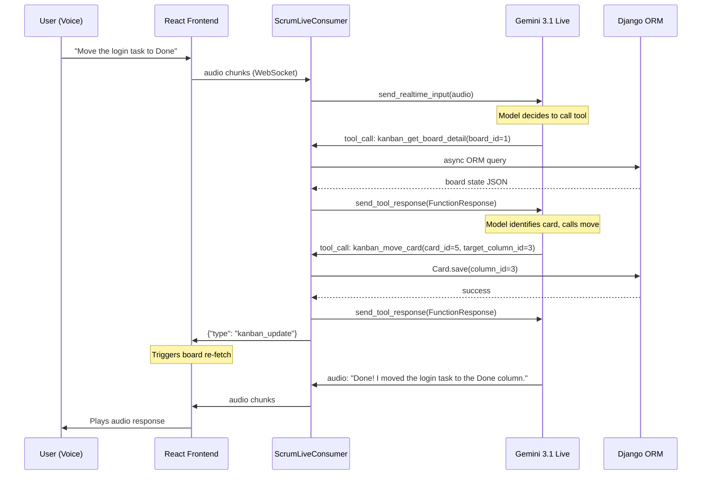

# Gemini Live Scrum Agent — Kanban Board Tool Integration

Give the Gemini Live voice agent the ability to **read, create, move, update, and delete Kanban cards** during a live scrum session, using native Gemini 3.1 Flash Live function calling.

## Research Summary

### Gemini 3.1 Flash Live — Tool Capabilities

| Capability | 3.1 Flash Live | Notes |
|---|---|---|
| **Synchronous Function Calling** | ✅ Supported | Model pauses output until `FunctionResponse` is returned |
| **Async Function Calling** (`NON_BLOCKING`) | ❌ Not supported | 3.1 only supports sequential/synchronous |
| **Google Search Grounding** | ✅ Supported | Not needed for Kanban |
| **Code Execution** | ❌ | — |
| **Tool Chaining** | ✅ | Model can issue multiple sequential tool calls in one turn |

**Key SDK Pattern** (from [wiki source](file:///c:/challenges/Hackathon-AI-Dev-Assistant/wiki_kb/raw/Tool%20use%20with%20Live%20API%20%20%20%20Gemini%20API%20%20%20%20Google%20AI%20for%20Developers.md)):
```python
# 1. Define declarations in config
tools = [{"function_declarations": [decl1, decl2, ...]}]
config = {"response_modalities": ["AUDIO"], "tools": tools}

# 2. In receive loop, detect tool_call
async for response in session.receive():
    if response.tool_call:
        function_responses = []
        for fc in response.tool_call.function_calls:
            result = execute_locally(fc.name, fc.args)
            function_responses.append(types.FunctionResponse(
                id=fc.id, name=fc.name, response={"result": result}
            ))
        await session.send_tool_response(function_responses=function_responses)
```

**Critical constraint:** On 3.1, function calling is **synchronous only** — the model will **stop talking and wait** until we send `send_tool_response`. This means our ORM calls need to be fast.

### Existing Codebase

| Component | Location | Key Details |
|---|---|---|
| **Live Consumer** | [consumers.py](file:///c:/challenges/Hackathon-AI-Dev-Assistant/server/scrum/consumers.py) | `ScrumLiveConsumer` — async WS consumer, already has `response.tool_call` placeholder at L93 |
| **Kanban Models** | [models/](file:///c:/challenges/Hackathon-AI-Dev-Assistant/server/scrum/models/) | `Board`, `Column`, `Card` (extends `CalendarEntry`), `Label`, `Comment`, `CardLabel` |
| **Kanban Views** | [kanban_views.py](file:///c:/challenges/Hackathon-AI-Dev-Assistant/server/scrum/views/kanban_views.py) | Full CRUD — `BoardViewSet`, `ColumnCardsView`, `CardMoveView`, etc. |
| **Existing Agent Tools** | [agents/scrum/tools/](file:///c:/challenges/Hackathon-AI-Dev-Assistant/server/scrum/agents/scrum/tools/) | Pattern: plain sync functions returning `dict` — `scrum_get_meeting_settings`, `scrum_generate_meeting_summary` |
| **Tool Call Audit Model** | [scrum_tool_call.py](file:///c:/challenges/Hackathon-AI-Dev-Assistant/server/scrum/models/scrum_tool_call.py) | `ScrumToolCall` — already tracks `tool_name`, `safe_input_summary`, `safe_result_summary`, `status`, `duration_ms` |

---

## Open Questions

> [!IMPORTANT]
> **Board Scope:** You said "all boards" — should `get_board_state` return a flat list of ALL boards with their columns and cards? Or should it return a summary index of boards first, and the agent can then drill into a specific board? Returning everything could be a large payload for the LLM context. I'd recommend a **two-tool approach**: `list_boards()` → returns board names/IDs, then `get_board_detail(board_id)` → returns full columns+cards for one board. Thoughts?

> [!WARNING]
> **Ambiguous Card References:** Since we're doing synchronous tool calls, the agent can use a multi-step strategy: 1) call `get_board_detail` first to get full card list with IDs, 2) use the ID in subsequent `move_card`/`update_card` calls. The model's in-context memory of the tool response will let it resolve names → IDs itself. Does this approach work for you, or do you want a `search_cards(query)` tool too?

> [!NOTE]
> **Frontend Live Updates:** When the agent modifies a card, we can push a `{"type": "kanban_update"}` message over the existing user WebSocket. The React `KanbanPage` can listen for this and trigger a re-fetch. This is the simplest path — no extra WebSocket channels needed. Alternatively, we skip this for MVP and the user just refreshes.

---

## Proposed Changes

### 1. Kanban Tool Functions (New File)

#### [NEW] [kanban_tools.py](file:///c:/challenges/Hackathon-AI-Dev-Assistant/server/scrum/agents/scrum/tools/kanban_tools.py)

Async-compatible tool functions using `database_sync_to_async`. Follows the existing tool pattern (plain functions returning `dict`).

```python
# Functions to implement:

async def kanban_list_boards() -> dict:
    """Returns list of all boards with id and name."""

async def kanban_get_board_detail(board_id: int) -> dict:
    """Returns full board state: columns (ordered) with their cards (ordered).
    Each card includes: id, title, description, priority, due_date, labels, is_overdue."""

async def kanban_add_card(column_id: int, title: str, priority: str = "medium", description: str = "") -> dict:
    """Creates a new card in the specified column. Returns the created card."""

async def kanban_move_card(card_id: int, target_column_id: int) -> dict:
    """Moves a card to a different column. Returns success/failure."""

async def kanban_update_card(card_id: int, title: str = None, description: str = None, priority: str = None) -> dict:
    """Updates card fields. Only non-None fields are changed."""

async def kanban_delete_card(card_id: int) -> dict:
    """Deletes a card. Returns success/failure."""
```

---

### 2. Function Declarations for Gemini

#### [NEW] [kanban_declarations.py](file:///c:/challenges/Hackathon-AI-Dev-Assistant/server/scrum/agents/scrum/tools/kanban_declarations.py)

Define the `function_declarations` dicts that Gemini needs. These follow the JSON Schema format used in the SDK:

```python
KANBAN_FUNCTION_DECLARATIONS = [
    {
        "name": "kanban_list_boards",
        "description": "List all Kanban boards. Returns board names and IDs.",
        "parameters": {"type": "object", "properties": {}}
    },
    {
        "name": "kanban_get_board_detail",
        "description": "Get full board state including all columns and cards.",
        "parameters": {
            "type": "object",
            "properties": {
                "board_id": {"type": "integer", "description": "The board ID to fetch"}
            },
            "required": ["board_id"]
        }
    },
    {
        "name": "kanban_add_card",
        "description": "Add a new card to a column on the Kanban board.",
        "parameters": {
            "type": "object",
            "properties": {
                "column_id": {"type": "integer", "description": "Target column ID"},
                "title": {"type": "string", "description": "Card title"},
                "priority": {"type": "string", "enum": ["low", "medium", "high", "urgent"]},
                "description": {"type": "string", "description": "Card description"}
            },
            "required": ["column_id", "title"]
        }
    },
    {
        "name": "kanban_move_card",
        "description": "Move a card to a different column.",
        "parameters": {
            "type": "object",
            "properties": {
                "card_id": {"type": "integer", "description": "Card ID to move"},
                "target_column_id": {"type": "integer", "description": "Target column ID"}
            },
            "required": ["card_id", "target_column_id"]
        }
    },
    {
        "name": "kanban_update_card",
        "description": "Update a card's title, description, or priority.",
        "parameters": {
            "type": "object",
            "properties": {
                "card_id": {"type": "integer", "description": "Card ID to update"},
                "title": {"type": "string"},
                "description": {"type": "string"},
                "priority": {"type": "string", "enum": ["low", "medium", "high", "urgent"]}
            },
            "required": ["card_id"]
        }
    },
    {
        "name": "kanban_delete_card",
        "description": "Delete a card from the Kanban board.",
        "parameters": {
            "type": "object",
            "properties": {
                "card_id": {"type": "integer", "description": "Card ID to delete"}
            },
            "required": ["card_id"]
        }
    }
]
```

---

### 3. Wire Tools into the Live Consumer

#### [MODIFY] [consumers.py](file:///c:/challenges/Hackathon-AI-Dev-Assistant/server/scrum/consumers.py)

Three changes:

**A. Add tools to the Gemini config** (L34-44):
```python
from scrum.agents.scrum.tools.kanban_declarations import KANBAN_FUNCTION_DECLARATIONS

config = {
    "response_modalities": ["AUDIO"],
    "speech_config": { ... },
    "tools": [{"function_declarations": KANBAN_FUNCTION_DECLARATIONS}],
    "system_instruction": """You are a helpful Scrum Master assistant with access to the team's Kanban board.
You can view boards, add cards, move cards between columns, update card details, and delete cards.
When the user asks about tasks, first use kanban_list_boards and kanban_get_board_detail to understand the current state.
When the user asks to add, move, update, or delete tasks, use the appropriate tool.
Always confirm what you did after completing an action."""
}
```

**B. Implement tool dispatch** (replace placeholder at L93-95):
```python
if response.tool_call:
    function_responses = []
    for fc in response.tool_call.function_calls:
        result = await self.dispatch_tool(fc.name, fc.args or {})
        function_responses.append(types.FunctionResponse(
            id=fc.id, name=fc.name, response={"result": result}
        ))
    await session.send_tool_response(function_responses=function_responses)
```

**C. Add `dispatch_tool` method:**
```python
async def dispatch_tool(self, name: str, args: dict) -> dict:
    """Route tool calls to the appropriate kanban function."""
    from scrum.agents.scrum.tools.kanban_tools import (
        kanban_list_boards, kanban_get_board_detail,
        kanban_add_card, kanban_move_card,
        kanban_update_card, kanban_delete_card,
    )
    TOOL_MAP = {
        "kanban_list_boards": kanban_list_boards,
        "kanban_get_board_detail": kanban_get_board_detail,
        "kanban_add_card": kanban_add_card,
        "kanban_move_card": kanban_move_card,
        "kanban_update_card": kanban_update_card,
        "kanban_delete_card": kanban_delete_card,
    }
    handler = TOOL_MAP.get(name)
    if not handler:
        return {"error": f"Unknown tool: {name}"}
    try:
        result = await handler(**args)
        # Optionally notify frontend
        if name in ("kanban_add_card", "kanban_move_card", "kanban_update_card", "kanban_delete_card"):
            await self.send(text_data=json.dumps({"type": "kanban_update"}))
        return result
    except Exception as e:
        return {"error": str(e)}
```

---

### 4. Register Exports

#### [MODIFY] [tools/__init__.py](file:///c:/challenges/Hackathon-AI-Dev-Assistant/server/scrum/agents/scrum/tools/__init__.py)

Add imports for the new kanban tool functions and declarations.

#### [MODIFY] [agents/scrum/__init__.py](file:///c:/challenges/Hackathon-AI-Dev-Assistant/server/scrum/agents/scrum/__init__.py)

Add kanban exports.

---

## Architecture Diagram



---

## Key Constraints & Decisions

| Decision | Rationale |
|---|---|
| **Synchronous tools only** | 3.1 Flash Live does not support `NON_BLOCKING`. Model pauses during tool execution. |
| **`database_sync_to_async`** | Consumer is async; Django ORM is sync. This is the standard Channels pattern. |
| **No board_id scoping** | Per your request — tools operate across all boards. `kanban_list_boards` lets the agent discover which boards exist. |
| **Agent resolves ambiguity** | No `search_cards` tool. The agent calls `kanban_get_board_detail` first, gets the full card list with IDs, and uses its own reasoning to match user intent to specific card IDs. |
| **Frontend notification via existing WS** | No new WebSocket channel. The same `ScrumLiveConsumer` connection sends `kanban_update` signals so the React UI can re-fetch. |

---

## Verification Plan

### Automated Tests
- Unit test each function in `kanban_tools.py` using Django's async test case
- Test the `dispatch_tool` routing with mock `fc` objects

### Manual Verification
1. Start both frontend and backend servers
2. Open Kanban page, ensure board has columns and cards
3. Start Scrum Live session
4. **Read test:** Say "What boards do we have?" → Agent should call `kanban_list_boards` and read results
5. **Detail test:** "Show me all the tasks on [board name]" → Agent calls `kanban_get_board_detail`
6. **Create test:** "Add a task called 'Fix login bug' to the To Do column" → Agent calls `kanban_add_card`, UI refreshes
7. **Move test:** "Move 'Fix login bug' to In Progress" → Agent calls `get_board_detail` then `kanban_move_card`
8. **Delete test:** "Remove the fix login bug card" → Agent calls `kanban_delete_card`
